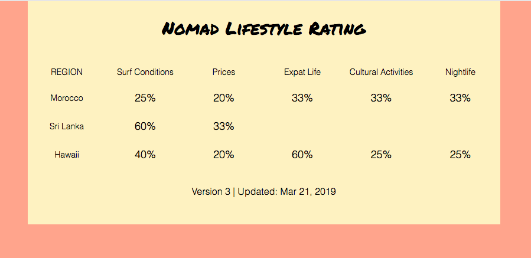
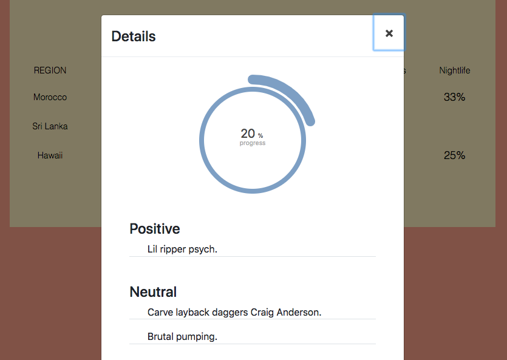

# Nomadguide

This project was generated with [Angular CLI](https://github.com/angular/angular-cli) version 7.1.0.

## About this project

Initially it started out as a status page I created for a client. The status page was initially supposed to visualize the completion state of each of the forms, per region.

I have then turned this into something I am more passionate about: Nomad Guide.

The idea is to rate several different destinations based on their surf-ability, but also more "Digital Nomad" related topics such as Price, Life Quality, Cultural Activities and Lifestyle.

This is an ongoing project that I am looking to constantly improve and grow - for now I am still at the beginning.

## Preview

## Resources:

I got the awesome surf Lorem ipsum from: http://surfipsum.com/

## Development server

Run `ng serve` for a dev server. Navigate to `http://localhost:4200/`. The app will automatically reload if you change any of the source files.

